# Диаграмма алгоритма планирования и распределения задач

Эта схема описывает целевой алгоритм планировщика: задача поступает как производственный запрос, ресурсы выбираются автоматически, очередь пересобирается заново, будущие задачи можно двигать только без нарушения их дедлайнов.

```mermaid
flowchart TD
    A([Поступила новая задача<br/>или запущен пересчет плана]) --> B[Загрузить полный стек незавершенных задач<br/>рабочего пространства]

    B --> C[Загрузить справочники и ресурсы:<br/>характеристики, типы оборудования, устройства,<br/>операторы, компетенции, закрепления,<br/>графики/перерывы, веса критериев, оценки устройств]

    C --> D{Задача участвует<br/>в рекомендациях?}
    D -- Нет --> D1[Оставить вне автоматического планирования]
    D1 --> Z([Конец])
    D -- Да --> E[Разделить задачи на группы]

    E --> F[Фиксированные задачи:<br/>выполненные или уже выполняющиеся<br/>их интервалы нельзя двигать]
    E --> G[Подвижные задачи:<br/>не начаты и не завершены<br/>их можно переставлять]

    F --> H[Построить занятость ресурсов:<br/>оборудование, операторы,<br/>перерывы и недоступность]
    G --> I[Сформировать очередь подвижных задач]

    I --> I1[Рассчитать риск срока:<br/>дедлайн - полная длительность - текущее время]
    I1 --> I2[Учесть ручной приоритет]
    I2 --> I3[Учесть базовый взвешенный балл задачи]
    I3 --> I4[Отсортировать очередь:<br/>риск срока → ручной приоритет → балл]

    H --> J[Для каждой задачи из очереди]
    I4 --> J

    J --> K[Определить требуемую характеристику задачи<br/>например: многоцветная печать, дерево,<br/>вытяжка, SLA, материал]

    K --> L{Есть требуемая<br/>характеристика?}
    L -- Нет --> L1[Разрешить все устройства,<br/>которые участвуют в рекомендациях]
    L -- Да --> L2[Найти типы оборудования,<br/>которые поддерживают характеристику]

    L1 --> M[Собрать устройства-кандидаты]
    L2 --> M

    M --> N{Есть совместимое<br/>оборудование?}
    N -- Нет --> N1[Пометить задачу как unscheduled:<br/>нет совместимого оборудования]
    N1 --> JNEXT{Есть следующая<br/>задача в очереди?}

    N -- Да --> O[Для каждого устройства определить<br/>допустимых операторов]

    O --> P[Оператор подходит, если есть компетенция<br/>на тип оборудования]
    P --> Q[Дополнительно учесть закрепление<br/>operator_device как бонус, а не жесткое правило]

    Q --> R{Есть подходящий<br/>оператор?}
    R -- Нет --> R1[Пометить задачу как unscheduled:<br/>нет оператора с компетенцией]
    R1 --> JNEXT

    R -- Да --> S[Построить кандидаты:<br/>задача + устройство + оператор + интервал]

    S --> T[Найти пересечения доступности:<br/>свободное устройство ∩ свободный оператор ∩ рабочий день]

    T --> U{Строгий режим:<br/>можно завершить до дедлайна?}

    U -- Да --> V[Оценить каждый кандидат<br/>по взвешенной формуле]
    U -- Нет --> W[Не выбирать слот, который ломает<br/>дедлайны других подвижных задач]

    W --> X{Это новая/целевая задача<br/>и строгий план невозможен?}
    X -- Нет --> X1[Вернуться к поиску другого кандидата<br/>или пометить как неразмещенную]
    X1 --> JNEXT

    X -- Да --> Y[Fallback-режим:<br/>найти ближайший реальный слот<br/>даже после дедлайна]
    Y --> Y1[Добавить предупреждение:<br/>deadline_missed]
    Y1 --> V

    V --> V1[Формула оценки кандидата]
    V1 --> V2[
        score =
        deadline_urgency * weight +
        manual_priority * weight +
        device_characteristic_score * weight +
        operator_device_preference * weight +
        earlier_completion * weight -
        lateness_penalty * weight -
        move_penalty * weight
    ]

    V2 --> V3[Выбрать кандидата с максимальным score]
    V3 --> V4[Забронировать интервал в рабочих календарях<br/>устройства и оператора]
    V4 --> V5[Зафиксировать выбранный план для задачи]

    V5 --> JNEXT
    JNEXT -- Да --> J
    JNEXT -- Нет --> AA[Сформировать результат пересчета]

    AA --> AB[Сохранить planning_run]
    AB --> AC[Сохранить planning_recommendation:<br/>выбранные и при необходимости альтернативные кандидаты]
    AC --> AD[Обновить device_task:<br/>plan_start, plan_end, device, operator]

    AD --> AE[Вернуть API-ответ:<br/>run_id, updated, warnings,<br/>recommendations, unscheduled_ids]
    AE --> AF[UI показывает:<br/>план, предупреждения, объяснение выбора,<br/>назначенные ресурсы]
    AF --> Z([Конец])
```



## Логика блоков

### 1. Вход задачи

Пользователь задает не готовое назначение на станок и оператора, а производственный запрос:

- название;
- дедлайн;
- длительность;
- время настройки;
- время снятия изделия;
- характеристику из справочника;
- ручной приоритет, если нужен;
- флаг участия в рекомендациях.

Оборудование и оператор могут быть заполнены вручную, но в целевой логике это результат работы планировщика.

### 2. Фиксированные и подвижные задачи

Фиксированные задачи нельзя переносить:

- задача уже выполнена;
- задача уже началась и сейчас выполняется.

Подвижные задачи можно переставлять, если:

- задача еще не началась;
- задача не завершена;
- новый интервал не выводит ее за собственный дедлайн;
- перенос не конфликтует с фиксированными интервалами оборудования и операторов.

### 3. Подбор ресурсов

Для каждой задачи алгоритм:

1. Берет характеристику задачи.
2. Находит типы оборудования, которые поддерживают характеристику.
3. Находит конкретные устройства этих типов, включенные в рекомендации.
4. Находит операторов с компетенцией на выбранный тип оборудования.
5. Добавляет бонус, если оператор закреплен за конкретным устройством.
6. Строит возможные интервалы из пересечения свободного времени устройства и оператора.

### 4. Строгий режим

Сначала алгоритм пытается построить план без просрочек:

- новая задача должна попасть до своего дедлайна;
- остальные подвижные задачи можно сдвигать;
- но ни одна сдвинутая задача не должна выйти за свой дедлайн.

Если такой план существует, выбирается лучший кандидат по score.

### 5. Fallback-режим

Если новая задача не помещается до дедлайна даже после допустимого сдвига будущих задач:

- алгоритм не нарушает дедлайны других задач ради новой;
- ищет ближайший реальный слот;
- ставит задачу в этот слот;
- добавляет предупреждение `deadline_missed`.

### 6. Оценка кандидатов

Каждый кандидат — это связка:

```text
задача + оборудование + оператор + интервал
```

Кандидат получает балл по весам рабочего пространства:

```text
score =
  срочность дедлайна
  + ручной приоритет
  + пригодность оборудования под характеристику
  + выгодность/эффективность устройства
  + бонус закрепленного оператора
  + бонус раннего завершения
  - штраф просрочки
  - штраф за перенос существующих задач
```

Пример: многоцветная задача получает бонус на принтере, где многоцветная печать выгоднее, но если срок под угрозой, более ранний слот может выиграть у более выгодного устройства.

### 7. Выход алгоритма

Результат пересчета должен содержать:

- выбранное время старта и завершения;
- выбранное оборудование;
- выбранного оператора;
- score;
- предупреждения;
- объяснение выбора;
- список неразмещенных задач;
- список рекомендаций;
- при наличии — список задач, которые были сдвинуты.

